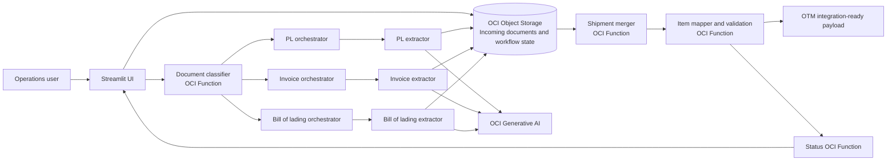

# Intelligent Shipment Document Automation on OCI

> **Sanitized ACE Project package.** This repository uses only generic names and synthetic data. Do not add client names, production identifiers, private keys, tokens, tenancy details, or real shipping documents.

## Overview

This project demonstrates an event-driven, fan-out/fan-in document-processing workflow built with Oracle Cloud Infrastructure (OCI). A Streamlit application submits incoming shipment documents for processing. OCI Functions classifies the pages, dispatches document-specific extraction jobs in parallel, consolidates the results, validates and maps shipment items, and produces an integration-ready payload for an Oracle Transportation Management (OTM) target.

The design is intended for commercial invoices, packing lists, and bills of lading. It uses OCI Object Storage as the durable workflow state store and OCI Generative AI for assisted extraction and normalization.

## Problem addressed

Shipment documents commonly arrive as multi-page PDFs with inconsistent layouts. Manual reading, cross-document comparison, item mapping, and transportation-system entry are slow and error-prone. This workflow automates those activities while preserving checkpoints for unresolved or invalid data.

## Architecture

The detailed diagram is available in [architecture.mmd](architecture.mmd). Render it in GitHub, Mermaid Live Editor, or any Mermaid-compatible Markdown viewer.



## Fan-out / fan-in workflow

1. An operator uploads a shipment document through the Streamlit UI.
2. The classifier reads the document, identifies relevant pages, assigns a document type, and records a workflow manifest in Object Storage.
3. The corresponding orchestrator splits work into page chunks and invokes extractors asynchronously.
4. Extractor invocations run in parallel; each uses OCI Generative AI to extract normalized business fields and writes chunk results to Object Storage.
5. The final extractor invocation combines its document’s chunks and creates a completion marker.
6. Once packing-list, invoice, and bill-of-lading outputs are ready, the shipment merger performs the fan-in step and produces a unified shipment record.
7. The item mapper reconciles quantities, validates weights, maps items, and records unresolved items for review.
8. The completed, validated result is made available as an OTM integration-ready payload. The UI retrieves workflow status through the status function.

## OCI services used

| Service | Role |
| --- | --- |
| OCI Functions | Serverless classifier, orchestrators, extractors, merger, mapper, and status API |
| OCI Object Storage | Input PDFs, manifests, chunk output, completion markers, and final JSON payloads |
| OCI Generative AI | Assisted extraction and semantic item-mapping fallback |
| OCI Logging | Function diagnostics and operational traceability |
| Oracle Transportation Management | Downstream target for validated shipment information |
| Streamlit | Operator-facing upload, progress, and result-review interface |

## Repository layout

```text
ACE Project/
├── README.md
├── architecture.mmd
├── docs/
│   ├── ACE_SUBMISSION.md
│   └── EVIDENCE_CHECKLIST.md
├── sanitized-source/          # Add only reviewed, sanitized function source
│   ├── document-classifier/
│   ├── packing-list-orchestrator/
│   ├── packing-list-extractor/
│   ├── invoice-orchestrator/
│   ├── invoice-extractor/
│   ├── bill-of-lading-orchestrator/
│   ├── bill-of-lading-extractor/
│   ├── shipment-merger/
│   ├── item-mapper/
│   └── workflow-status/
└── evidence/                  # Sanitized screenshots and demo-video link
```

## Deployment approach

1. Create or select an OCI Functions application with required network access.
2. Create an Object Storage bucket for input documents and workflow artifacts.
3. Configure dynamic groups and IAM policies so functions can read/write only the required bucket and invoke the required OCI services.
4. Define secrets and identifiers as function configuration or OCI Vault secrets—never hard-code them.
5. Deploy each sanitized function with its `func.yaml` and `requirements.txt`.
6. Configure the Streamlit UI using environment variables or a secrets manager.
7. Submit a synthetic PDF, inspect the Object Storage manifest/status, and verify the final integration-ready payload.

## Security and privacy

- Do not commit `.pem`, `.key`, `.env`, OAuth client secrets, OCI config files, API tokens, or real client documents.
- Replace organization/client names with `Sample Logistics Organization`, `Supplier A`, and `Customer A`.
- Replace production OCIDs, namespaces, bucket names, URLs, shipment IDs, and item codes with placeholders.
- Use OCI resource principals and Vault-managed secrets in deployments.
- Include only synthetic inputs and sanitized screenshots in `evidence/`.

## Demonstration

For an ACE review, add a 3–5 minute screen recording showing:

1. The Streamlit upload using a synthetic shipment document.
2. The OCI Functions application and Object Storage workflow artifacts (with IDs blurred).
3. Parallel document processing and status retrieval.
4. The merged validation result and the integration-ready output.

See [docs/EVIDENCE_CHECKLIST.md](docs/EVIDENCE_CHECKLIST.md) for the complete submission checklist.

## Local development

Each function should retain its own `requirements.txt` and `func.yaml`. Keep configuration in a non-committed local `.env` file and supply a reviewed `.env.example` containing placeholders only. Test with synthetic documents; do not use customer data.

## Author contribution

I designed and implemented the OCI Functions fan-out/fan-in workflow, document classification and extraction routing, object-storage state management, cross-document validation, item mapping, and the Streamlit operator interface. I also created the deployment and evidence documentation for this demonstration.

